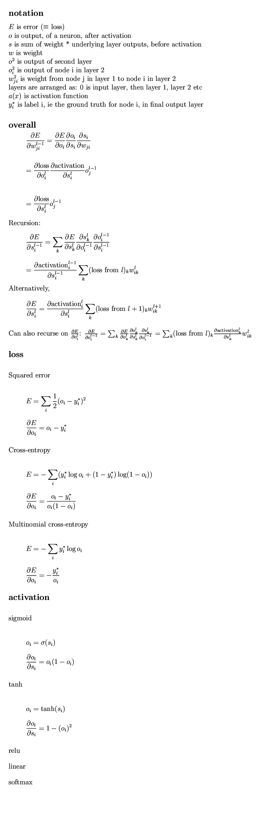

ClConvolve
==========

Contents
========

<!-- START doctoc generated TOC please keep comment here to allow auto update -->
<!-- DON'T EDIT THIS SECTION, INSTEAD RE-RUN doctoc TO UPDATE -->
**Table of Contents**  *generated with [DocToc](https://github.com/thlorenz/doctoc)*

- [ClConvolve](#clconvolve)
- [Commandline usage](#commandline-usage)
  - [Additional net-def options](#additional-net-def-options)
  - [Additional layer types](#additional-layer-types)
    - [Random patches](#random-patches)
    - [Random translations](#random-translations)
  - [Multi-column deep neural network "MultiNet"](#multi-column-deep-neural-network-multinet)
  - [Pre-processing](#pre-processing)
  - [File types](#file-types)
  - [Weight persistence](#weight-persistence)
  - [Command-line options](#command-line-options)
- [Validation against standard datasets](#validation-against-standard-datasets)
  - [NORB](#norb)
  - [MNIST](#mnist)
- [Neural Net API](#neural-net-api)
  - [Create a net](#create-a-net)
  - [Add an input layer](#add-an-input-layer)
  - [Normalization layer](#normalization-layer)
  - [Random patch layer](#random-patch-layer)
  - [Random translations layer](#random-translations-layer)
  - [Convolutional layers](#convolutional-layers)
  - [Fully connected layers](#fully-connected-layers)
  - [Max-pooling layers](#max-pooling-layers)
  - [Loss layer](#loss-layer)
  - [Data format](#data-format)
  - [Train](#train)
  - [Test](#test)
- [To use the pre-built binaries](#to-use-the-pre-built-binaries)
- [To build](#to-build)
  - [linux](#linux)
    - [Pre-requisites](#pre-requisites)
    - [Procedure](#procedure)
  - [Windows](#windows)
    - [Pre-requisites](#pre-requisites-1)
    - [Procedure](#procedure-1)
  - [Linking](#linking)
  - [What if it doesn't run?](#what-if-it-doesnt-run)
- [Testing](#testing)
  - [Correctness checking](#correctness-checking)
  - [Unit-testing](#unit-testing)
    - [Concepts](#concepts)
    - [Implementation](#implementation)
- [Formulae notes](#formulae-notes)
- [What if I need a new feature?](#what-if-i-need-a-new-feature)
- [What if I want to contribute myself?](#what-if-i-want-to-contribute-myself)
  - [Development technical details](#development-technical-details)
  - [Architecture](#architecture)
- [What's done / what's planned](#whats-done--whats-planned)
- [Recent changes](#recent-changes)
- [Third-party libraries](#third-party-libraries)
- [License](#license)

<!-- END doctoc generated TOC please keep comment here to allow auto update -->

ClConvolve
==========

OpenCL library to train deep convolutional networks
- C++
- OpenCL
- Deep convolutional

Functionalities:
* convolutional layers
* max-pooling
* normalization layer
* random translations, as in [Flexible, High Performance Convolutional Neural Networks for Image Classification](http://ijcai.org/papers11/Papers/IJCAI11-210.pdf)
* random patches, as in [ImageNet Classification with Deep Convolutional Networks](http://papers.nips.cc/paper/4824-imagenet-classification-with-deep-convolutional-neural-networks)
* multinet, ie Multi-column deep convolutional network, [McDnn](http://arxiv.org/pdf/1202.2745.pdf)
* simple command-line network specification, as per notation in [Multi-column Deep Neural Networks for Image Classification](http://arxiv.org/pdf/1202.2745.pdf)
* pad-zeros possible for convolutional layer
* various activation functions available:
  * tanh
  * scaled tanh (1.7519 * tanh(2/3x) )
  * linear
  * sigmoid
  * relu
  * softmax
* fully-connected layers
* various loss layers available:
  * square loss
  * cross-entropy
  * multinomial cross-entropy (synonymous with multinomial logistic, etc)

Example usage:
- intend to target 19 x 19 Go boards, eg something similar to [Clark and Storkey](http://arxiv.org/abs/1412.3409) or [Maddison, Huang, Sutskever and Silver](http://arxiv.org/abs/1412.6564)
  - obtained 35.1% test accuracy, using 16 million training records from the [kgsgo v2 dataset](https://github.com/hughperkins/kgsgo-dataset-preprocessor)
  - commandline used `./clconvolve1 dataset=kgsgoall netdef=32c5{z}-32c5{z}-32c5{z}-32c5{z}-32c5{z}-32c5{z}-500n-361n numepochs=3 learningrate=0.0001 numtrain=16000000`
  - 3 epochs, 14 hours per epoch, on an Amazon GPU instance, comprising half an NVidia GRID K520 GPU
- obtained 99.5% test accuracy on MNIST, using `netdef=rt2-8c5{padzeros}-mp2-16c5{padzeros}-mp3-150n-10n numepochs=20 multinet=6 learningrate=0.002`
  - epoch time 99.8 seconds, using an Amazon GPU instance, NVidia GRID K520 GPU (since we are learning 6 nets in parallel, so 16.6seconds per epoch per net)

# Commandline usage

* Syntax is based on that specified in Ciresan et al's [Multi-column Deep Neural Networks for Image Classification](http://arxiv.org/pdf/1202.2745.pdf), section 3, first paragraph:
  * network is defined by a string like: `100C5-MP2-100C5-MP2-100C4-MP2-300N-100N-6N`
  * `100C5` means: a convolutional layer, with 100 filters, each 5x5
  * `MP2` means a max-pooling layer, over non-overlapping regions of 2x2
  * `300N` means a fully connected layer with 300 hidden units
* Thus, you can do, for example:
```bash
./clconvolve1 netdef=8c5-mp2-16c5-mp3-10n learningrate=0.002 dataset=mnist
```
... in order to learn mnist, using the same neural net architecture as used in the [convnetjs mnist demo](http://cs.stanford.edu/people/karpathy/convnetjs/demo/mnist.html)
* Similarly, you can learn NORB, using approximately the architecture specified in [lecun-04](http://yann.lecun.com/exdb/publis/pdf/lecun-04.pdf), by doing:
```bash
./clconvolve1 netdef=8C5-MP4-24C6-MP3-80C6-5N learningrate=0.0001 dataset=norb
```
* Or, you can train NORB using the very deep, broad architecture specified by Ciresan et al in [Flexible, High Performance Convolutional Neural Networks for Image Classification](http://ijcai.org/papers11/Papers/IJCAI11-210.pdf):
```bash
./clconvolve1 netdef=MP3-300C6-MP2-500C4-MP4-500N-5N learningrate=0.0001 dataset=norb
```

## Additional net-def options

* You can add additional options in `{}` brackets after each layer, eg:
```bash
./clconvolve1 netdef=8c5{tanh}-mp2-16c5{tanh}-mp3-10n learningrate=0.002 dataset=mnist
```
* Options currently available:
  * For convolution layers:
    * `sigmoid`
    * `tanh`
    * `scaledtanh` (ie, 1.7159f * tanh( 0.66667f * x ) )
    * `linear`
    * `relu` (default)
    * `padzeros` (or simply `z`)
* can be combined, comma-separated (no spaces), eg:
```bash
./clconvolve1 netdef=8c5{tanh,z}-mp2-16c5{tanh,z}-mp3-10n learningrate=0.002 dataset=mnist
```

## Repeated layers

* simply prefix a layer with eg `3*` to repeat it.  `3*` will repeat the layer 3 times, and similar for other numbers, eg:
```
./clconvolve1 netdef=6*32c5{z}-500n-361n learningrate=0.0001 dataset=kgsgoall
```
... will create 6 convolutional layers of 32 5x5 filters each.

## Additional layer types

### Random patches

* `RP24` means a random patch layer, which will cut a 24x24 patch from a random position in each incoming image, and send that to its output
* during testing, the patch will be cut from the centre of each image
* can reduce over-training, and thus give better test accuracies
* image size output by this layer equals the the patch size
* eg you can try, on MNIST, `netdef=rp24-8c5{padzeros}-mp2-16c5{padzeros}-mp3-150n-10n`
* example paper using this approach: [ImageNet Classification with Deep Convolutional Networks](http://papers.nips.cc/paper/4824-imagenet-classification-with-deep-convolutional-neural-networks)

### Random translations

* `RT2` means a random translations layer, which will translate the image randomly during training, up to 2 pixels, in either direction, along both axes
* Can specify any non-negative integer, less than the image size
* Image size is unchanged by this layer
* During testing, no translation is done
* eg you can try, on MNIST, `netdef=rt2-8c5{padzeros}-mp2-16c5{padzeros}-mp3-150n-10n`
* example paper using this approach: [Flexible, High Performance Convolutional Neural Networks for Image Classification](http://ijcai.org/papers11/Papers/IJCAI11-210.pdf)

## Multi-column deep neural network "MultiNet"

* You can train several neural networks at the same time, and predict using the average output across all of them using the `multinet` option
* Simply add eg `multinet=3` in the commandline, to train across 3 nets in parallel, or put a number of your choice

## Pre-processing

* Note that the datasets must be in the NORB .mat format specified at [NORB-small dataset](http://www.cs.nyu.edu/~ylclab/data/norb-v1.0-small/) page
    * For mnist, you can convert from idx to mat format using `idx-to-mat`:
```bash
./idx-to-mat ../data/mnist train
./idx-to-mat ../data/mnist t10k
```
* For NORB, the training set as originally downloaded is unshuffled.  In addition, the test set is far larger than is needed for evaluating accuracy up to 0.1%.  Therefore, you might want to run `prepare-norb`:
  * shuffles the training set, creating `training-shuffled-dat.mat` and `training-shuffled-cat.mat`
  * draws 1000 test samples, and writes them to `testing-sampled-dat.mat` and `testing-sampled-cat.mat`
```bash
./prepare-norb
```

## File types

* Using the new `GenericLoader.cpp`, it's possible to automatically detect various filetypes
* When specifying a training or validation file, if there is both a labels and an images file, then specify the images file, and the labels file will be detected automatically
* Currently, the following filetypes are supported:
  * Norb .mat format
  * kgs go v2 format, [https://github.com/hughperkins/kgsgo-dataset-preprocessor](https://github.com/hughperkins/kgsgo-dataset-preprocessor)
* As long as the format has a header section, there's no particular reason why it couldnt be supported

## Weight persistence

* If we're going to train for hours or days, we probably want to make sure that if our process gets interrupted, we don't lose our training so far
* By default, weights will be written to `weights.dat`, after each epoch
* If you specify option `loadweights=1`, the weights will be loadeded at the start
* You can change the weights file with option `weightsfile=somefilename.dat`
* If you specify option `loadweights=1`:
  * the `netdef`, the `datadir`, and the `trainfile` will be compared to that used to generate the current weights file: if any of them are different, then ClConvolve will refuse to carry on, so that you don't overwrite the weights file inadvertently
    * If you need something like, ClConvolve prompts you, showing the differences, and asks if you want to continue, then please raise an issue, and I will add this in
  * Note that the epoch number will continue from the weights.dat file, so make sure to increase `numepochs` appropriately, otherwise ClConvolve will start, load the weights file, and then exit again, since all epochs have been finished :-P

## Command-line options

| Option | Description |
|----|----|
| dataset=norb | sets datadir, trainfile and validatefile according to one of several dataset profiles.  Current choices: mnist, norb, cifar10, kgsgo, kgsgoall |
| datadir=../data/mnist | path to data files |
| trainfile=train-dat.mat | name of training data file, the one with the images in.  Note that the labels file will be determined automatically, based on the data filename and type, eg in this case `train-cat.mat` |
| validationfile=validate-dat.mat | name of the validation data file, the one with the images in.  Note that the labels file will be determined automatically, based on the data filename and type, eg in this case `validate-cat.mat` |
| numtrain=1000 | only uses the first 1000 training samples |
| numtest=1000 | only uses the first 1000 testing samples |
| netdef=100c5-10n | provide the network definition, as documented in [Commandline usage](#commandline-usage]) above |
| learningrate=0.0001 | specify learning rate |
| anneallearningrate=0.95 | multiply learning rate by this after each epoch, as described in [Ciresan et al](http://ijcai.org/papers11/Papers/IJCAI11-210.pdf) |
| numepochs=20 | train for this many epochs |
| batchsize=128 | size of each mini-batch.  Too big, and the learning rate will need to be reduced.  Too small, and performance will decrease.  128 might be a reasonable compromise |
| normalization=maxmin | can choose maxmin or stddev.  Default is stddev |
| normalizationnumstds=2 | how many standard deviations from mean should be +1/-1?  Default is 2 |
| normalizationexamples=50000 | how many examples to read, to determine normalization values |
| multinet=3 | train 3 networks at the same time, and predict using average output from all 3, can put any integer greater than 1 |
| loadondemand=1 | Load the file in chunks, as learning proceeds, to reduce memory requirements. Default 0 |
| filebatchsize=50 | When loadondemand=1, load this many batches at a time.  Numbers larger than 1 increase efficiency of disk reads, speeding up learning, but use up more memory |
| weightsfile=weights.dat | file to store weights in, after each epoch.  If blank, then weights not stored |
| loadweights=1 | load weights at start, from weightsfile.  Current training config, ie netdef and trainingfile, should match that used to create the weightsfile.  Note that epoch number will continue from file, so make sure to increase numepochs sufficiently |

# Validation against standard datasets

## NORB

* Download the data files from [NORB datafiles](http://www.cs.nyu.edu/~ylclab/data/norb-v1.0-small/), and place in `data/norb`, decompressed, ie (g)unzipped
* Pre-process, to shuffle the training samples, and draw 1000 testing samples:
```bash
./prepare-norb
```
* Run training, eg, based on LeCun's lenet-7:
```bash
./clconvolve1 netdef=8C5-MP4-24C6-MP3-80C6-5N learningrate=0.00001 dataset=norb
```
* On an Amazon AWS GPU instance, which has an NVidia GRID K520 GPU, this has epoch time of 76 seconds, and reaches test accuracy of around 91.7% after around 200 epochs (train accuracy 99.996%!)

## MNIST

* You can download the MNIST data from [MNIST database](http://yann.lecun.com/exdb/mnist/) , and place in the `data\mnist` directory, (g)unzipped.
* Convert from idx to mat format:
```bash
./idx-to-mat ../data/mnist train
./idx-to-mat ../data/mnist t10k
```
* Run as per the [convnetjs MNIST demo](http://cs.stanford.edu/people/karpathy/convnetjs/demo/mnist.html) architecture as follows:
```bash
./clconvolve1 netdef=8c5{padzeros}-mp2-16c5{padzeros}-mp3-10n learningrate=0.002 dataset=mnist
```
* On an Amazon AWS GPU instance, epoch time is about 13.8 seconds, giving about 98.7% test accuracy, after 12 epochs
* Actually, I think the following gives slightly better test accuracy, about 99.0%, using 17.2seconds per epoch:
```bash
./clconvolve1 netdef=8c5{padzeros}-mp2-16c5{padzeros}-mp3-150n-10n learningrate=0.002 dataset=mnist
```

# Neural Net API

* You can create a network in C++ directly.  As an example, to create a `8C5-MP2-16C5-MP3-150N-10N` network, for MNIST, you could do:
```c++
NeuralNet *net = new NeuralNet();
net->addLayer( InputMaker<unsigned char>::instance()->numPlanes(1)->boardSize(28) );
net->addLayer( NormalizationMaker::instance()->translate( -mean )->scale( 1.0f / standardDeviation ) );
net->addLayer( ConvolutionalMaker::instance()->numFilters(8)->filterSize(5)->relu()->biased() );
net->addLayer( PoolingMaker::instance()->poolingSize(2) );
net->addLayer( ConvolutionalMaker::instance()->numFilters(16)->filterSize(5)->relu()->biased() );
net->addLayer( PoolingMaker::instance()->poolingSize(3) );
net->addLayer( FullyConnectedMaker::instance()->numPlanes(150)->boardSize(1)->tanh()->biased() );
net->addLayer( FullyConnectedMaker::instance()->numPlanes(10)->boardSize(1)->linear()->biased() );
net->addLayer( SoftMaxLossMaker::instance() );
net->print();
```
* The following sections will detail the various layers available, and the options available for each layer type
* Data must be provided in contiguous, 1d format, see below

## Create a net

```c++
#include "ClConvolve.h"

NeuralNet *net = new NeuralNet();
```

## Add an input layer

* You need exactly one input layer
* This is templated, so you can feed it an array of `unsigned char *`, or `float *`, later, as you wish.  If you want to feed in data as `float *`, then do:
```c++
net->addLayer( InputMaker<float>::instance()->numPlanes(10)->boardSize(19) );
```
* If you want to feed in data as `unsigned char *`, then do:
```c++
net->addLayer( InputMaker<unsigned char>::instance()->numPlanes(10)->boardSize(19) );
```
* You need to set the number of input planes, and the board size.

## Normalization layer

* You can add a normalization layer, to translate and scale input data.  Put it just after the input layer, like this:
```c++
NeuralNet *net = new NeuralNet();
net->addLayer( InputMaker<float>::instance()->numPlanes(10)->boardSize(19) );
net->addLayer( NormalizationMaker::instance()->translate( - mean )->scale( 1.0f / standardDeviation ) );
// other layers here...
```

## Random patch layer

* You can add a random patch layer, to cut a patch from each image, in a random location, and train against that
* You need to specify the patch size, eg on minst, which is 28x28 images, you might use a patch size of 24
* During training the patch location is chosen randomly, per image, per epoch
* Size of output image from this layer is the size of the patch
* During testing, the patch is cut from the centre of the image
```c++
net->addLayer( RandomPatchMaker::instance()->patchSize(24) );
```

## Random translations layer

* You can add a random translations layer, to randomly translate each input image by a random amount, during training
* During testing, no translation is done
* If you put eg `translateSize(2)`, then the translation amount will be chosen uniformly from the set `{-2,-1,0,1,2}`, for each axis.
* Output image from this layer is same size as input image
```c++
net->addLayer( RandomTranslationsMaker::instance()->translateSize(2) );
```

## Convolutional layers

Eg:
```c++
net->addLayer( ConvolutionalMaker::instance()->numFilters(32)->filterSize(5)->relu()->biased() );
```

* You can change the number of filters, and their size.  If you want, you can use any of the following options:
  * `->padZeros()`: pad the input board with zeros, so the output board is same size as the input
  * `->biased()` turn on bias
  * `->biased(1)` same as `->biased()`
  * `->biased(0)` turn off bias (default)
  * `->linear()` choose linear activation
  * `->relu()` choose relu activation
  * `->sigmoid()` choose sigmoid activation
  * `->tanh()` choose tanh activation (current default, but defaults can change...)
  * `->scaledtanh()` `1.7159 * tanh(0.66667 * x )`
* convolutional layers forward-prop and backward-prop both run on GPU, via OpenCL

## Fully connected layers

eg:
```c++
net->addLayer( FullyConnectedMaker::instance()->numPlanes(2)->boardSize(28) );
```

Available options:
  * `->biased()` turn on bias
  * `->biased(1)` same as `->biased()`
  * `->biased(0)` turn off bias (default)
  * `->linear()` choose linear activation
  * `->relu()` choose relu activation
  * `->sigmoid()` choose sigmoid activation
  * `->tanh()` choose tanh activation (current default, but defaults can change...)
  * `->scaledtanh()` `1.7159 * tanh(0.66667 * x )`

## Max-pooling layers

```c++
net->addLayer( PoolingMaker::instance()->poolingSize(2) );
```
* By default, if the input board size is not an exact multiple of the poolingsize, the extra margin will be ignored
* You can specify `padZeros` to include this margin:
```c++
net->addLayer( PoolingMaker::instance()->poolingSize(2)->padZeros() );
```

## Loss layer

You need to add exactly one loss layer, as the last layer of the net.  The following loss layers are available:
```c++
net->addLayer( SquareLossMaker::instance() );
net->addLayer( CrossEntropyMaker::instance() );
net->addLayer( SoftMaxLayer::instance() );
```
* if your outputs are categorial, 1-of-N, then softMaxLossLayer is probably what you want
* otherwise, you can choose square loss, or cross-entropy loss:
  * squared loss works well with a `tanh` last layer
  * cross entropy loss works well with a `sigmoid` last layer
  * if you're not sure, then `tanh` last layer, with squared loss, works well
* the softmax layer:
  * creates a probability distribution, ie a set of outputs, that sum to 1, and each lie in the range `0 <= x <= 1`
  * can create this probability distribution either across all output planes, with a boardsize of 1
    * this is the default
  * or else a per-plane probability distribution
    * add option `->perPlane()`

## Data format

Input data should be provided in a contiguous array, of `float`s (edit: or `unsigned char` now!  Or anything that is castable to a float).  "group by" order should be:

* training example id
* input plane
* board row
* board column

Providing labels, as an integer array, is the most efficient way of training, if you are training against categorical data.  The labels should be provided as one integer per example, zero-based.

* in this case, the last layer of the net should have the same number of nodes as categories, eg a `netdef` ending in `-5n`, if there are 5 categories
* if using the C++ API, you would probably want to use a `softmax` loss layer

For non-categorical data, you can provide expected output values as a contiguous array of floats. "group by" order for the floats should be:

* training example id
* output plane (eg, corresponds to filter id, for convolutional network)
* output row
* output column

## Train

eg:
```c++
// (create a net, as above)
// train, eg on unsigned char input data:
NetLearner<unsigned char> netLearner( net );
netLearner.setTrainingData( Ntrain, trainData, trainLabels );
netLearner.setTestingData( Ntest, testData, testLabels );
netLearner.setSchedule( numEpochs );
netLearner.setBatchSize( batchSize );
netLearner.learn( learningRate );
// learning is now done :-)
```

## Test

eg
```c++
// (create a net, as above)
// (train it, as above)
// test, eg for unsigned char input data:
BatchLearner<unsigned char> batchLearner( net );
int testNumRight = batchLearner.test( batchSize, Ntest, testData, testLabels );
```

# To use the pre-built binaries

Pre-built binaries are available for Windows-64, for certain releases.  In order to use them you need:
* [Windows 2013 redistributable](http://www.microsoft.com/en-us/download/details.aspx?id=40784).
* An OpenCL driver for your GPU

#To build

## linux

### Pre-requisites

- git
- cmake
- gcc
- g++
- An OpenCL-compatible driver installed, and OpenCL-compatible GPU
  - tested using beignet, which provides OpenCL 1.2; and on CUDA 6.5 driver
- opencl-headers
- make 

### Procedure

```bash
git clone --recursive https://github.com/hughperkins/ClConvolve.git
cd ClConvolve
mkdir build
cd build
cmake ..
make
```

Note:
* be sure to add `--recursive` when you clone, else when you build it will complain about OpenCLHelper missing (or clew missing)
  * if you do forget, you can experiment with running `git submodule init --recursive`, and then `git submodule update --recursive`
* you might need to play around with commands such as `git submodule update --recursive` occasionally, to pull down new OpenCLHelper updates

## Windows

### Pre-requisites

- git
- cmake
- Visual Studio (tested on 2013 Community Edition)
- An OpenCL-compatible driver installed, and OpenCL-compatible GPU

### Procedure

- in git, do `git clone --recursive https://github.com/hughperkins/ClConvolve.git`
- create a subdirectory `build` in the git cloned `ClConvolve` directory
- open cmake, point at the `ClConvolve` directory, and set to build in the `build` subdirectory
  - `configure` then `generate`
- open visual studio, and load any of the projects in the `build` directory
  - change release type to `Release`
  - choose `build` from the `build` menu
- after building, you will need to copy the *.cl files by hand, from the `cl` directory

## Linking

You will need:
- libClConvolve.so (or ClConvolve.dll)
- ~~*.cl files~~ *.cl files no longer needed at runtime :-)  They're packaged inside the dll/so now.

~~The *.cl files should be in the current working directory at the time that you call into any ClConvolve methods.~~

## What if it doesn't run?

* Check if you have an OpenCL-enabled device on your system
  * ideally a GPU, or accelerator, since there is no attempt to optimize ClConvolve for CPUs (at least, not currently, could change, feel free to submit a pull request :-) )
* Try running `gpuinfo` (from [OpenCLHelper](https://github.com/hughperkins/OpenCLHelper), but built as part of this project too, for ease of use )
  * it should output at least one OpenCL-enabled device
  * if it doesn't, then you need to make sure you have an OpenCL-enabled device, and that appropriate drivers are installed, and that the ICD is configured appropriately (registry in Windows, and `/etc/OpenCL/vendors` in linux)

# Testing

## Correctness checking

* For forward propagation:
  * We slot in some numbers, calculate the results manually, and compare with results actually obtained
  * We also forward propagate pictures/photos, and check the results look approximately like what we would expect
* For backward propagation:
  * We use numerical validation, since the sum of the square of the weight changes, divided by the learning rate, approximately equals the change in loss.  Or it should. We test this :-)
* Standard test sets
  * Checked using implementations for MNIST, and NORB is in progress

## Unit-testing

### Concepts

* Network optimization is stochastic, and there are typically numerous local minima, into which the optimization can get stuck
* For unit testing, this is not very suitable, since unit tests must run repeatably, reliably, quickly
* Therefore, for unit-testing, the network weights are preset to a fixed set of values
  * using a random number generator with a fixed seed
  * or by explicitly giving a hard-coded set of weights
* Then, the test checks that the network converges to better than an expected loss, and accuracy, within a preset number of epochs
* We also have unit tests for forward-propagation, and backward propagation, as per section [Correctness checking](#correctness-checking) above.

### Implementation

* Using googletest, which:
  * compiles quickly
  * gives awesome colored output
  * lets you choose which tests to run using `--gtest_filter=` option
* Dont need to install anything: it's included in the `thirdparty` directory, and added to the build automatically
* To run the unit tests:
```bash
make unittests
./unittests
```
* To run just the unittests for eg `testbackprop`, do:
```bash
make unittests
./unittests --gtest_filter=testbackprop.*
```
* To skip any slow tests, do:
```bash
./unittests --gtest_filter=-*SLOW*
```
* Actually, by default, with no arguments, the argument `--gtest_filter=-SLOW*` will be appended automatically
* Also, rather than having to type `--gtest_filter=[something]`, you can just type `tests=[something]`, and this will be converted into `--gtest_filter=[something]` automatically

# Formulae notes

These are generic formulae, but just putting them here, so I remember them ;-)



# What if I need a new feature?

Please raise an issue, let me know you're interested.
* If it's on my list of things I was going to do sooner or later anyway (see below), I might do it sooner rather than later.
* If it's to do with usability, I will try to make that a priority

What if I want to contribute myself?
=================

- please feel free to fork this repository, tweak things, send a pull request

## Development technical details
* [cogapp](http://nedbatchelder.com/code/cog/) generator is used extensively, to accelerate development, reduce the number of manual copy-and-pasting and so on.  Specifically, it's used for:
  * generating header declarations from .cpp definition files
  * generating fluent-style argument classes for certain tests
  * ... and more uses will surely be found :-)
* You need Python installed and available for this to work.  You don't need python just to
build the sources, but if you do have python installed, and you flip the `PYTHON_AVAILABLE` switch in the 
cmake configuration, then a lot of manual editing will no longer be necessary :-)

## Architecture

* [NeuralNet.h](src/NeuralNet.h) is a container for layers. It contains three types of method:
  * methods that iterate over each layer, eg `propagate`
  * methods that call a method on the first layer, eg `getInputCubeSize`
  * methods that call a method on the last layer, eg `getResults()`
* Various net layers, eg [ConvolutionalLayer.cpp](src/ConvolutionalLayer.cpp), [PoolingLayer.cpp](src/PoolingLayer.cpp), etc
* Trying to debug/unit-test by training whole layers is challenging, so the layer implementations are factorized, over two levels.  The first level abstracts away propagation, backprop of errors, and backprop of weights:
  * [Propagate.cpp](src/Propagate.cpp) handles forward propagation
  * [BackpropErrorsv2.cpp](src/BackpropErrorsv2.cpp) handles backward propagation of errors (strictly speaking: of the partial derivative of the loss with respect to the pre-activation sums for the layer)
    * The results of this layer are passed back through the stack of layers
  * [BackpropWeights2.cpp](src/BackpropWeights2.cpp) handles backward propagation of weights, from the results of the appropriate BackpropErrorsv2 layer
* Then, each of these classes calls into implementation classes, which are children of the same class, which provide various kernels and implementations.  Eg, for [Propagate.h](src/Propagate.h], we have:
  * [Propagate1.cpp](src/Propagate1.cpp)
  * [Propagate2.cpp](src/Propagate2.cpp)
  * [Propagate3.cpp](src/Propagate3.cpp)
  * ...
* ... and similarly for [BackpropErrorsv2](src/BackpropErrorsv2.cpp), and [BackpropWeights2.cpp](src/BackpropWeights2.cpp): each has implementation classes
* Therefore:
  * Testing can target one single implementation, or target only propagate or backproperrors, or backpropweights, rather than needing to test an entire network
  * These lower level factorized implementations could also plausibly be an appropriate unit of re-use
* There are also "meta"-layers, ie:
  * [PropagateAuto.cpp](src/PropagateAuto.cpp): automatically tries different propagate kernels at run-time, and chooses the fastest :-)

What's done / what's planned
============================

* Done:
  * forward/backward propagation, for convolutional networks, using OpenCL
  * square loss
  * zero-padding
  * relu activation
  * tanh activation
  * linear activation
  * some optimization of the OpenCL kernels
  * can save/load weights
  * can use 'fluent' style to setup the networks
  * unit-tests for forward propagation
  * numerical validation for backward propagation
* Planned, short-term:
  * ~~softmax activation function~~ DONE
  * ~~cross entropy loss~~ DONE
  * ~~multinomial cross entropy loss~~ DONE
  * ~~get working with [kgs go data](https://github.com/hughperkins/kgsgo-dataset-preprocessor)~~ DONE
    * ~~created GenericLoader, which automatically detects filetype~~
    * ~~created Kgsv2Loader, which handles kgsgo v2 data files~~
    * ~~added loadondemand, so can load data as we go, during learning, rather than trying to load the entire dataset in one go~~
  * symmetric filters
  * skip, as described in [Ciresan et al, 2011](http://arxiv.org/pdf/1102.0183v1.pdf)
  * fuse convolutional and max-pooling layers, so can optimize more
  * ~~create a 'transforming input' layer, to handle things like:~~ DONE
    * ~~conversion from `unsigned char *` to `float *`~~ DONE
    * ~~translation and scaling by mean and standard deviation~~ DONE
  * testing result averaged over several propagations (used in conjunction with `rp`)
  * sparse connectivity between feature maps in adjacent layers
  * ~~MCDNN?~~ DONE
  * migrate to use `async_work_group_copy`?
* Plausible, medium-term (pull requests welcome):
  * maybe L2 regularization?
  * ~~randomly translating input layer?~~ DONE
  * mpi so can run over several gpus, spread across multiple hosts???
    * implemented mpi in `testmnist-mpi`.  If works ok, will generalize to something more permanent
  * generalization to non-square images
  * ~~generalization to larger images~~ kind of done, ish, for NORB
  * drop-out ... or maybe [DropConnect](http://cs.nyu.edu/~wanli/dropc/dropc.pdf) ?
  * Python bindings?
  * scaling? rotations? mirroring?
  * ~~max-pooling?~~ DONE
  * ~~read network from a config file?~~ soft of done with the `netdef` syntax

Recent changes
==============

Dates are dates of code change / commit, rather than date merged into master, or tagged.
* 17th February:
  * migrated max-pooling backprop to gpu
* 15th February:
  * removed runtime dependency on *.cl files
* 13th February:
  * created PropagateAuto, which tries each kernel once, for one batch, and then picks the fastest
* 10th February:
  * increased speed of fully-connected propagation by 5-8 times :-)
* 7th Februrary:
  * added support for kgs go v2 format [https://github.com/hughperkins/kgsgo-dataset-preprocessor](https://github.com/hughperkins/kgsgo-dataset-preprocessor)
  * added loadondemand, which makes it possible to read a file in chunks, as learning proceeds, reducing memory requirements
  * created `GenericLoader.cpp`, which can auto-detect file types, given the path of the images file
* 5th February:
  * added multinet: multi-column networks
* 3rd Februrary:
  * added RandomTranslations layer
* 2nd February:
  * added RandomPatches layer
* 1st Februrary:
  * builds and runs on Windows
* 31st January:
  * added NormalizationLayer
  * templated InputLayer, for different input array types, which simplifies BatchLearner class
* 30th January:
  * add scaled tanh, ie 1.7159f * tanh(0.66667f * x )
* 29th January:
  * fix showstopper bug in idx-to-mat
  * add {sigmoid}, {tanh}, {scaledtanh}, {linear} options
  * add normalization=maxmin, normalization=stddev (default)
  * add {padzeros} options
* 27th January:
  * builds on Windows
* 26th January:
  * Unified mnist and norb testing executable
  * Implemented network-definition, as specified in [Ciresan et al](arxiv.org/pdf/1202.2745.pdf)
  * Created idx-to-mat, to convert from mnist idx format to norb mat format
  * Massively overhauled this readme in the light of these changes
  * Added annealed learning rate, as described in [Ciresan et al](http://ijcai.org/papers11/Papers/IJCAI11-210.pdf)
  * Add reasonably robust restart-file
* 25th January:
  * Added gpu implementation for max-pooling forward-prop
  * Added padZeros option for max-pooling
  * Accelerated backpropweights kernel a bit, for larger images (ie norb, 96x96)
* 24th January:
  * added max-pooling layer (albeit in cpu for now)
  * created draft 'lenet5' implementation, but it's not quite the same, specifically:
    * lenet-5 has RBF layers at the end
    * lenet-5 has multiple of these RBF and fully-connected layers at the end
    * lenet-5 is not using max-pooling but something more like average-pooling, and it has an activation function applied (sigmoid)
  * added the mnist training config from [convnetjs](http://cs.stanford.edu/people/karpathy/convnetjs/demo/mnist.html)
  * noticed we are actually in January, not December, and updated the name of the month in this section appropriately :-P
* 23rd January:
  * created `testmnist-mpi`, to experiment with using mpi to parallelize across multiple compute nodes (which must each have a GPU, which GPUs must ideally each be the same model/specifications)
* 22nd January:
  * re-added FullyConnectedLayer, which is now a wrapper around ConvolutionalLayer, with one filter per output node.  So, if we want a 28x28 board as the output, this will need 784 filters in the underlying convolutional layer, which
sounds excessive, but this is how a fully connected layer works :-)
  * best mnist accuracy now at 98.6%
* 21st January:
  * added softmax layer, for per-column configuration, ie multi-planar output, with boardsize 1
    * tested once on mnist: 97.65% test accuracy after 12 epochs; 98.09% after 20 epochs
* week up to 21st January: 
  * added sigmoid activation
  * added cross-entropy loss layer
  * migrated to recurse on dLoss/dSum, rather than dLoss/dOutput, ie on partial derivative of loss with input to activation function for each neuron, rather than with output.  Recursing on input instead of output is faster
  * changed learning rate, so that the square of the sum of the weight changes equals approximately the change in loss, for smallish changes in w, so that we can numerically validate easily
  * validated backpropagation numerically
  * migrated to use explicit square-loss layer
  * moved sources to `src` sub-directory, so root directory cleaner
  * created `SLOW_` prefix for slow tests, so can run with `gtest_filter=-SLOW*` to ignore slow tests

Third-party libraries
=====================

* [OpenCLHelper](https://github.com/hughperkins/OpenCLHelper)
* [clew](https://github.com/martijnberger/clew)
* [libpng++](http://www.nongnu.org/pngpp/doc/0.2.1/)

License
=======

[Mozilla Public License 2.0](http://mozilla.org/MPL/2.0/)


